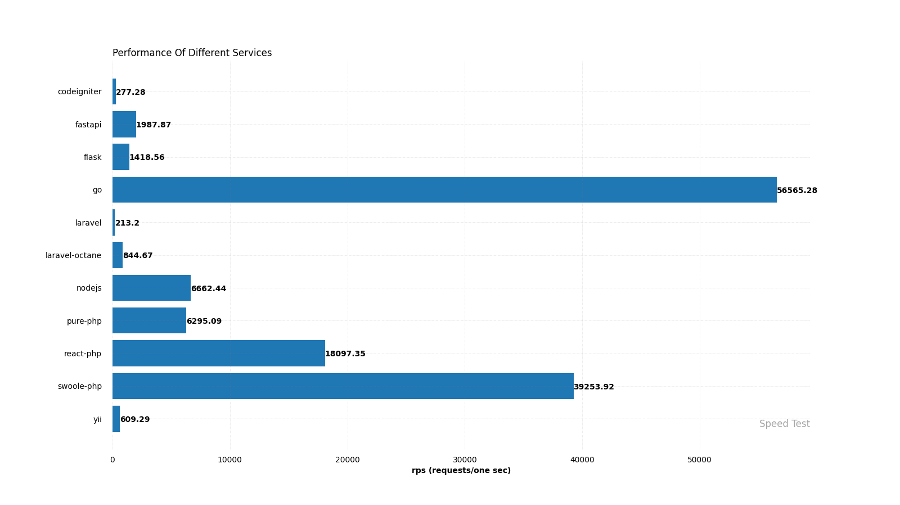
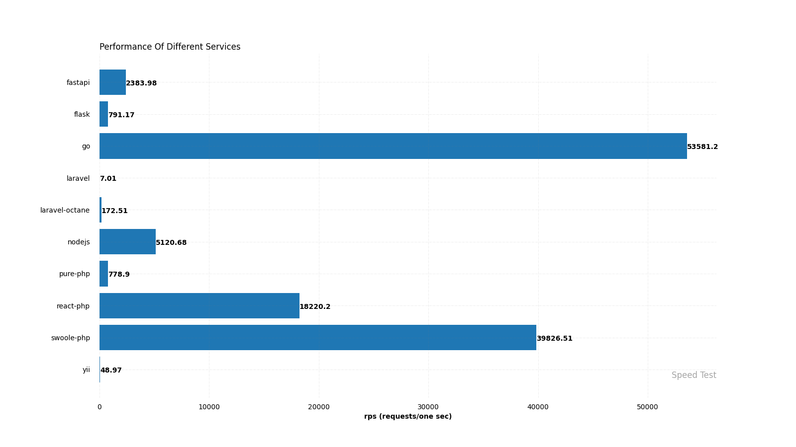

# Speed Test

The "Speed Test" project is designed to benchmark the performance of various programming languages/frameworks by comparing their request-per-second (RPS) capabilities for a simple "Hello World" implementation. This README provides instructions on how to run the tests, generate results, and visualize the data.

## Motivation

The main motivation behind this project was to compare the RPS (request-per-second) performance of different frameworks and languages, including Go, pure PHP, Swoole-PHP, ReactPHP, and Node.js. The goal was to gain insights into the performance characteristics of these technologies and identify potential strengths and weaknesses in handling concurrent requests.

## Default Test Configuration

| Tool | Concurrent Connections (-c) | Test Duration/Requests (-t or -d) |
|------|-----------------------------|-----------------------------------|
| ab   | 100                         | 10 seconds                        |
| wrk  | 100                         | 10 seconds                        |
| hey  | 100                         | 10,000 requests                   |

## Running the Tests

To run the tests and collect data, follow these steps:

1. **Start Services:** Execute the following commands in your terminal to initiate the speed tests for different programming languages/frameworks:

```shell
./scripts/test-ab.sh
./scripts/test-hey.sh
./scripts/test-wrk.sh
```

2. **Review Results:** After running the tests, navigate to the `export` folder, where you will find the results categorized by test type in the subfolders `ab`, `wrk`, and `hey`. These subfolders contain text files containing throughput results of all tested languages/frameworks.

3. **Generate CSV Files:** Additionally, the `export` folder will contain CSV files that provide detailed information about the request-per-second (RPS) performance of each programming language/framework. These CSV files are useful for in-depth analysis and further comparison.

Please note that running these services in a Docker environment ensures consistent and isolated test environments.

## Visualizing Results

To gain better insights into the collected data, you can generate bar chart images from the CSV files. Follow these steps:

1. **Create Bar Chart Images:** Execute the following command in the terminal:

```shell
./scripts/plt.sh
```

2. **View Bar Chart Images:** The script will convert the CSV files in the `export` folder into bar chart images in PNG format. These images will be stored in the `export` folder, making it convenient to visualize the results.

## Unexpected Observations

During the tests, I made an interesting observation. The RPS results for Node.js were unexpectedly low compared to my initial expectations. I had anticipated that Node.js would achieve around 20,000 RPS, but the actual results did not meet this expectation.

## Recommendations

For more accurate results and to perform tests on a larger scale, it is recommended to execute the commands on a more powerful server. This would ensure that the performance of each programming language/framework is assessed under optimal conditions, reducing the influence of local machine specifications on the results.

## Result Summary

Here are two sample images displaying the results of Apache Bench and Wrk tests:

### Apache Bench:



### Wrk Result:



### Hey Result:


## Conclusion

By following these instructions and considering the unexpected observations, you can conduct comprehensive performance tests for various programming languages/frameworks. The project provides valuable insights into the RPS capabilities of different implementations, allowing you to make informed decisions based on performance benchmarks. If you encounter any issues or have suggestions for improvement, please feel free to contribute to the project. Happy testing!

