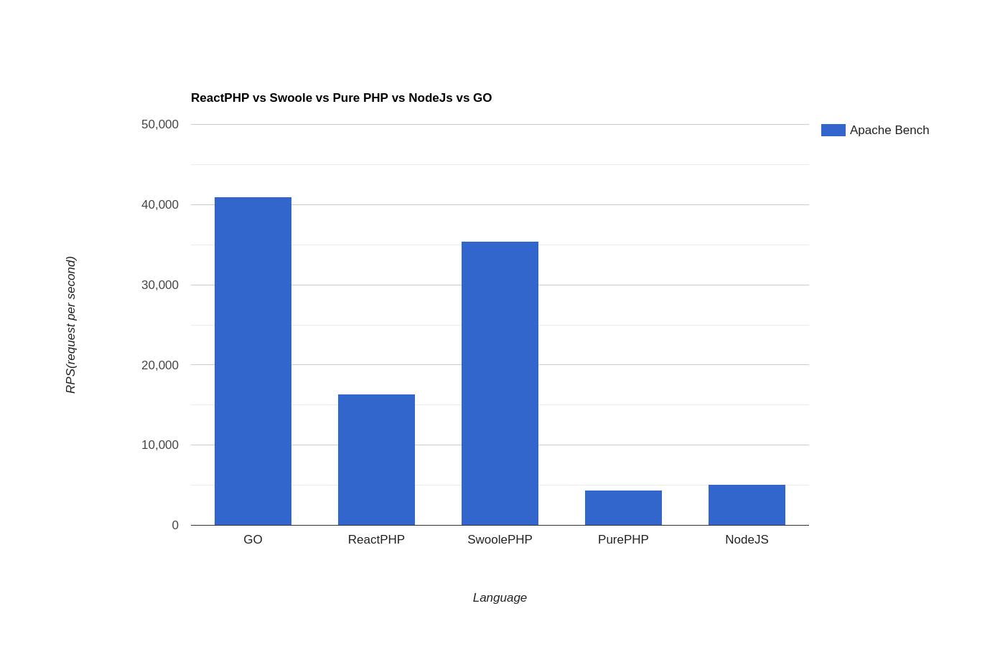
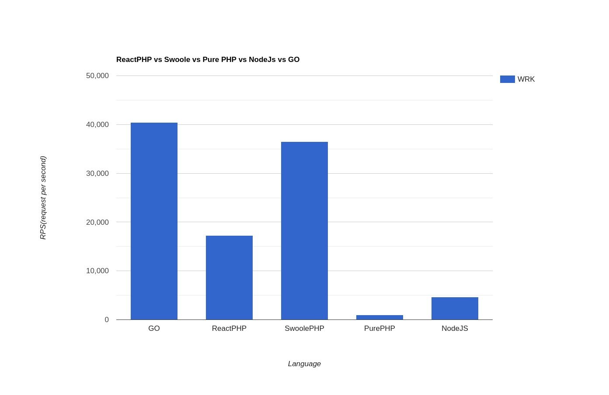

# ReactPHP vs Swoole vs Pure PHP vs NodeJs vs GO

## Run Hello World

```shell
docker-compose up -d
```

## requests
```shell
#hello world
docker-compose run --rm ab -k -c 100 -n 100000 http://swoole-php/hello-world > results/ab-swoole-php-hw-c-100-n-100000.txt
docker-compose run --rm ab -k -c 100 -n 100000 http://pure-php/hello-world > results/ab-pure-php-hw-c-100-n-100000.txt
docker-compose run --rm ab -k -c 100 -n 100000 http://react-php/hello-world > results/ab-react-php-hw-c-100-n-100000.txt
docker-compose run --rm ab -k -c 100 -n 100000 http://nodejs/hello-world > results/ab-nodejs-hw-c-100-n-100000.txt
docker-compose run --rm ab -k -c 100 -n 100000 http://go/hello-world > results/ab-go-hw-c-100-n-100000.txt


docker-compose run --rm wrk -t4 -c100 -d20s --latency http://swoole-php/hello-world > results/wrk-swoole-php-hw-c-100-d20s.txt
docker-compose run --rm wrk -t4 -c100 -d20s --latency http://pure-php/hello-world > results/wrk-pure-php-hw-c-100-d20s.txt
docker-compose run --rm wrk -t4 -c100 -d20s --latency http://react-php/hello-world > results/wrk-react-php-hw-c-100-d20s.txt
docker-compose run --rm wrk -t4 -c100 -d20s --latency http://nodejs/hello-world > results/wrk-nodejs-hw-c-100-d20s.txt
docker-compose run --rm wrk -t4 -c100 -d20s --latency http://go/hello-world > results/wrk-go-hw-c-100-d20s.txt
```

## result

### Apache Bench:



### Wrk Result:

